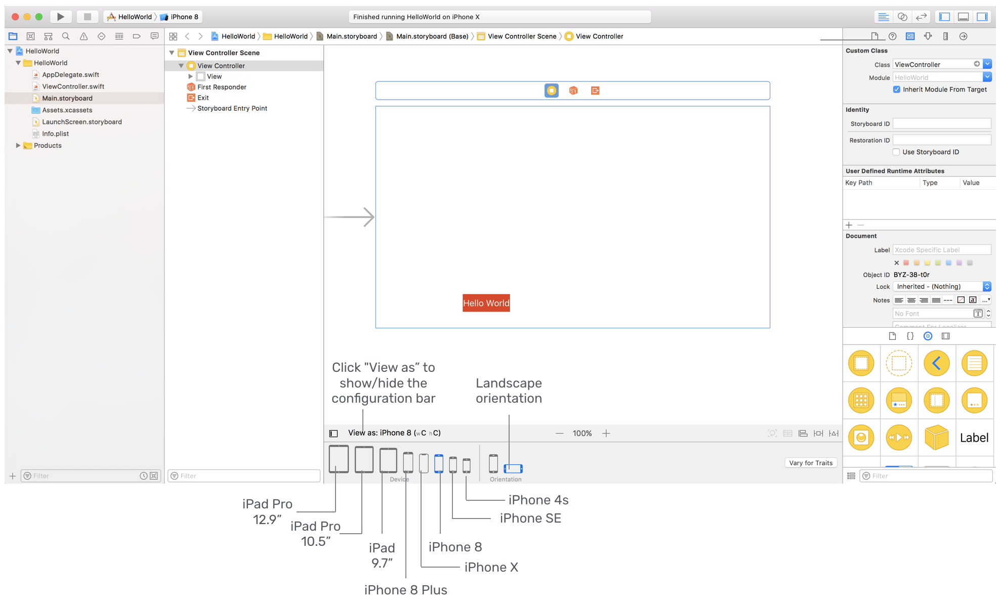

# iOS Autolayout Tutorial

 (Image thanks to AppCoda)

**Welcome!** Today you will learn about autolayout in iOS. The detailed tutorial can be found [here](https://www.raywenderlich.com/160527/auto-layout-tutorial-ios-11-getting-started)

If you prefer to watch YouTube video, here is a great [series](https://www.youtube.com/watch?v=27TFuaOpUsE&list=PL23Revp-82LI-MTPyLtvzTCDl-vJKwjlU&index=1). (The source code for the videos is not available). 

Enjoy!

App Development & Software Engineering Club
